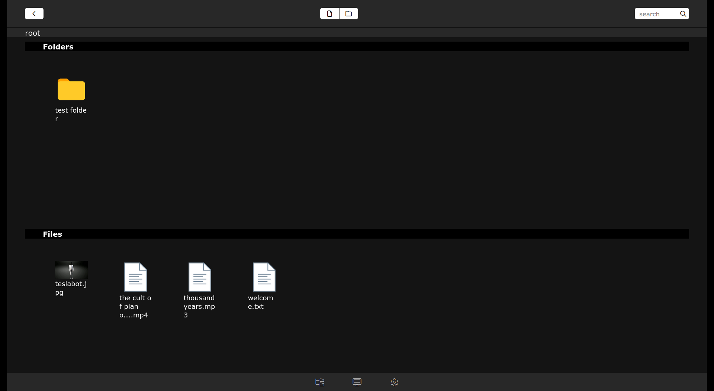

⚠️ Archived – Learning/Experimental Project

Built during an earlier exploration phase.
Left as-is for reference; not actively maintained.

# File Manager

A lightweight, web-based file manager for managing files on a local server through a browser interface. This project provides an intuitive and responsive UI to upload, organize, and manage files without needing to use SSH or command-line tools.



---

## Features

* **Browse & Navigate** – Explore directories and view file structures.
* **Upload & Download** – Easily upload files to the server or download existing files.
* **Create, Rename, Delete** – Manage folders and files directly from the web interface.
* **Search** – Quickly locate files by name.
* **Cross-Platform** – Works on Linux, macOS, and Windows servers.
* **Web-Based** – No need for a desktop client, just use your browser.

---

## Getting Started

### Prerequisites

* Python 3.8+
* Flask
* Any modern web browser

### Installation

```bash
git clone https://github.com/alien5516788/File_manager.git
cd File_manager
pip install -r requirements.txt
```

### Run

```bash
python app.py
```
or
```bash
gunicorn app:app
```

---

## Tech Stack

* **Backend**: Python (Flask)
* **Frontend**: HTML, CSS, JavaScript (Jquery)
* **Deployment**: Works locally or can be hosted on a home server / cloud VM

---

## Security Notes

This project is intended for **personal or educational use**. If deployed to the internet, make sure to:

* Use authentication & HTTPS.
* Restrict access to trusted users.
* Configure file permissions properly.

---

## Roadmap / Future Enhancements

* ✅ Basic file operations
* 🔲 Implement multiuser support
* 🔲 Drag-and-drop file uploads
* 🔲 Dark mode UI
* 🔲 Remote server access
